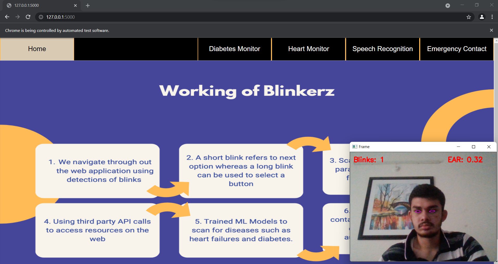
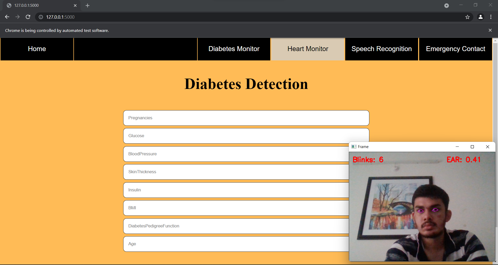
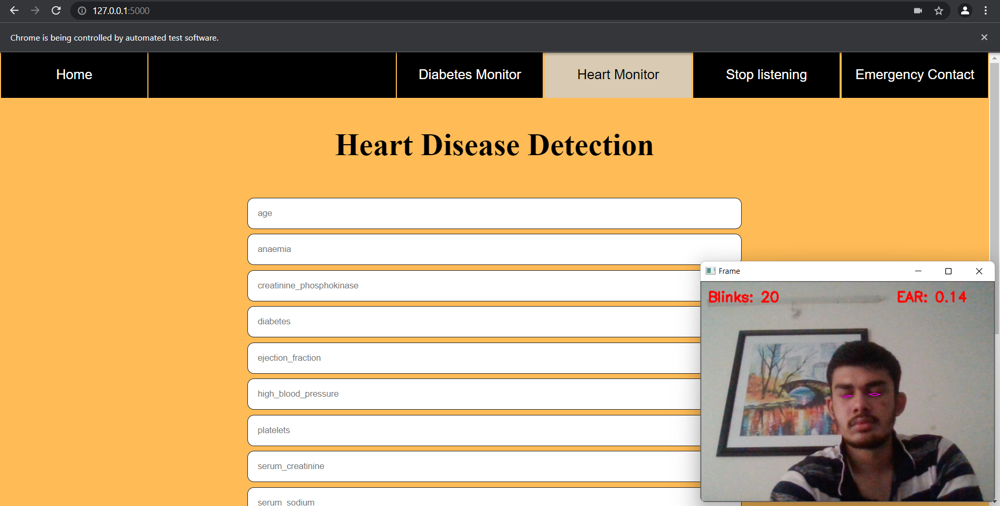
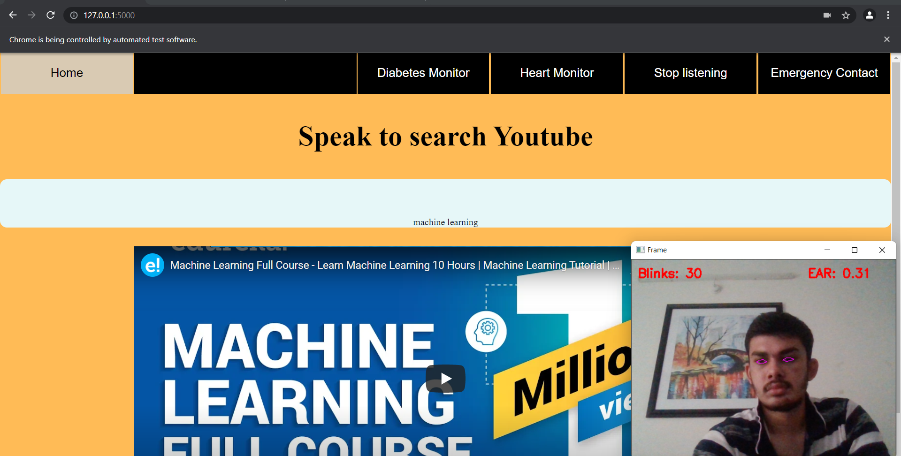
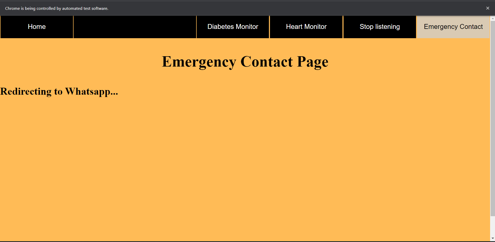

#  DevJams'21 - Blinkers
Public Repo For DevJams'21

#  Blinkerz
## Track: Digital Accessibility
Project Presented by TEAM : Blinkers


# Our Team
Member | Role
------------- | -------------
Aviral Jain   | Team Lead (Backend & ML)
Vidipt Khetriwal  |  Frontend
Arhit  |  Backend & ML


##  Overview of the Project

>One stop solution for all accessing the internet at the blink of an eye. Simple Web App with an automation software to cater needs of education, entertainment, and health.

##  Significance of the Project

* Integrates a fully functional one stop
destination for the one's who are physically
handicapped or unable to access web

* Revolutionize the means of
accessing the world wide web at their own
convenience

* Bring together
emergency and health features to cater one's
needs.


##  Objectives we want to achieve

* We want our app to help people with muscular atrophy and other motor disabilities to access the internet at their own convenience.

* The app helps physically handicapped people to cater to their health needs and emergency needs.

##  Project Timeline

Phase 01 :
We started the out with our problem statement and then carried on an ideation train. Discovered a novelty point. Decided on all the features the application can have.

Phase 02 :
Structured out the framework of the app and made the design for the app in figma. Created the Blink Detection Algorithm.

Phase 03 :
Trained the ML models for health features

Phase 04 :
Integrating all the work packages and finalizing it. 
Deploying the app. Deploying the software

### Prerequisites

- Python 3.8.10 and the latest version of pip.
  
## How to use the app:

1. Fork it.

2. Clone the repo
   ```sh
   git clone https://github.com/CaptAlpha/DevJams-21-HackRepo.git
   ```
3. Install `requirements.txt`
   ```sh
   pip install -r requirements.txt
   ```
4. Run `blinkerz.py`
   ```
    cd Blink-Detection-Module
    python blinkerz.py
   ```


##  Our Project:







